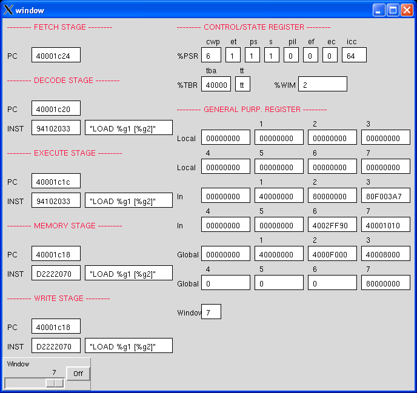

# LEON2_debugger
The goal of this project was to improve software debugging when simulating a VHDL model of the LEON2 processor based hardware in the ModelSim simulator. It was usually much hard to simulate a VHDL model with an embedded software in the ModelSim simulator (Version 6). One can step through the VHDL code, examine variables and signals, but it is much time consuming and requires more practical skill.

In order to solve such problems a processor-specific debugger developed in Tcl/Tk. The debugger presents the assembly code under execution and the certain important contents of the integer unit.

To start the debugger invoke the "source debugger.tcl" command on the command line of ModelSim after loading a testbench.

A screenshot of the debugger depicts:
- pipeline stages, such as program counter value and instruction opcode
- control/state registers (PSR, WIM, TBR)
- general purpose registers, in windowed stucture
